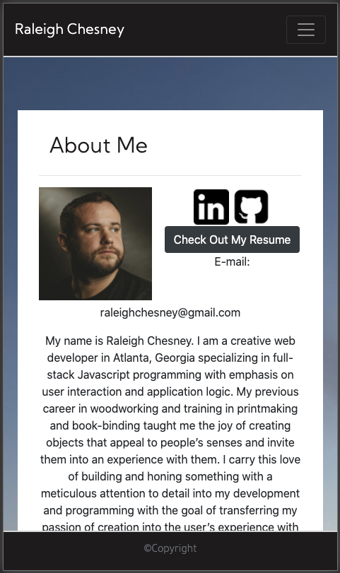
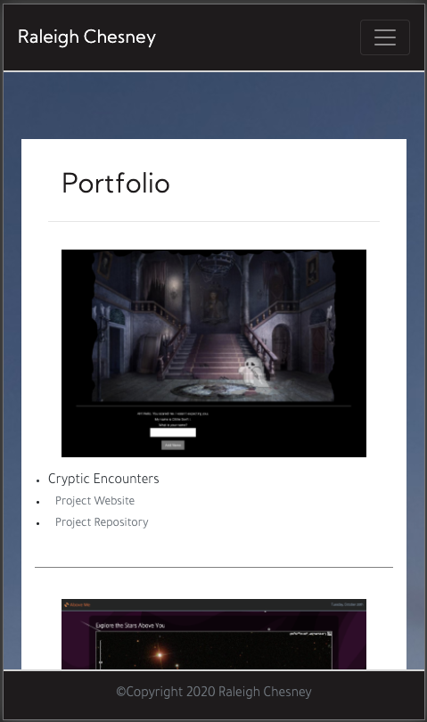
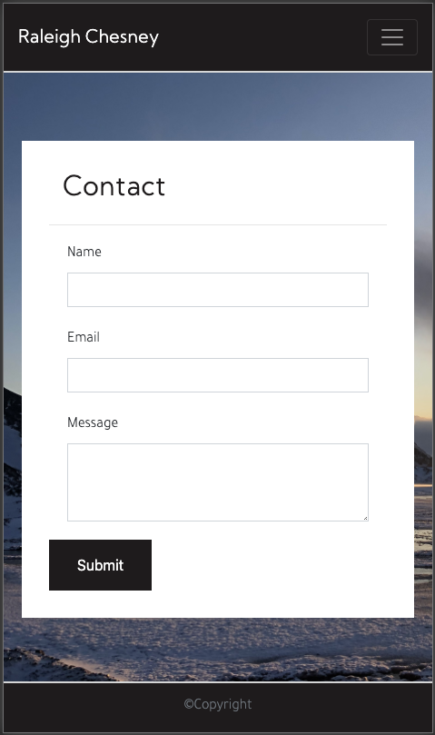

# My Professional Portfolio

My portfolio is a page to introduce myself and my work to potential employers and customers.

[Portfolio Page](https://raleighc.github.io/portfolio_02_redux/)

## Usage
This website consists of three pages:
* [About Me](https://raleighc.github.io/portfolio_02_redux/index.html)
* [Portfolio](https://raleighc.github.io/portfolio_02_redux/portfolio.html)
* [Contact](https://raleighc.github.io/portfolio_02_redux/contact.html)

It presents my work and personal information as well as gives potential clients links to my social media and a way to contact me. It is coded in a responsive format ready for use on mobile and PC.
Through a series of links in the navbar
potential customers can learn about my and my work and visit my linkedin and guthub pages for further professional information.

## Creating This Page

It is interesting to look back on the past two months and see how far I have come. Being able to change my portfolio out from old artwork to completed coding projects I am proud of felt good. This struggles with updating this portfolio were mostly in fine tuning the styling away from looking like a bootstrap page on first look. The next step I want to take is adding in javascript to dynamically populate the portfolio and give it more animation.

## Contributions

When contributing to this repository, please contact the owner of the repository before pushing any updates.
When contributions are accepted, please update the readme.md noting any changes that have been made.

## Authors and Acknowledgment

The following list of resources were crucial in the creation of this site.

* [Bootstrap](https://getbootstrap.com/)
* [Google Custom Fonts](https://fonts.google.com/)
* [w3schools!](https://www.w3schools.com/bootstrap4/default.asp)
* [W3C Validation](https://validator.w3.org/)

## License

MIT License

Copyright (c) 2020 Raleigh Chesney

Permission is hereby granted, free of charge, to any person obtaining a copy
of this software and associated documentation files (the "Software"), to deal
in the Software without restriction, including without limitation the rights
to use, copy, modify, merge, publish, distribute, sublicense, and/or sell
copies of the Software, and to permit persons to whom the Software is
furnished to do so, subject to the following conditions:

The above copyright notice and this permission notice shall be included in all
copies or substantial portions of the Software.

THE SOFTWARE IS PROVIDED "AS IS", WITHOUT WARRANTY OF ANY KIND, EXPRESS OR
IMPLIED, INCLUDING BUT NOT LIMITED TO THE WARRANTIES OF MERCHANTABILITY,
FITNESS FOR A PARTICULAR PURPOSE AND NONINFRINGEMENT. IN NO EVENT SHALL THE
AUTHORS OR COPYRIGHT HOLDERS BE LIABLE FOR ANY CLAIM, DAMAGES OR OTHER
LIABILITY, WHETHER IN AN ACTION OF CONTRACT, TORT OR OTHERWISE, ARISING FROM,
OUT OF OR IN CONNECTION WITH THE SOFTWARE OR THE USE OR OTHER DEALINGS IN THE
SOFTWARE.
